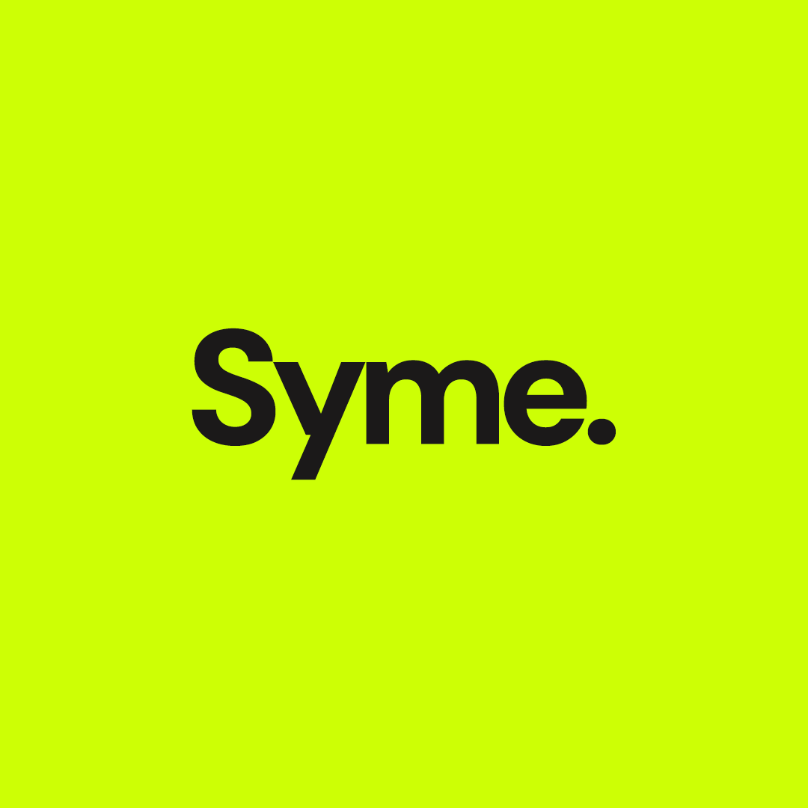

# Syme: Advanced PDF Forensic Manipulation Engine

<p align="center">
  
</p>

> *"Don't you see that the whole aim of Newspeak is to narrow the range of thought? In the end we shall make thought-crime literally impossible, because there will be no words in which to express it."* — **Syme, 1984**

**Syme** is a professional-grade, offline-first PDF manipulation and redaction suite. Inspired by the specialist from George Orwell’s *1984*, this tool follows a singular philosophy: **Eliminate the unnecessary and preserve the essential.** It is designed for high-precision text extraction and structural sanitization across documents of any scale.

## Key Features

### Linguistic Detection Engine
- **String Mode**: Rapid literal text matching for quick cleanups.
- **Word Mode (Linguistic)**: Advanced tokenization that respects word boundaries (e.g., target "pro" without affecting "professional").
- **Regex Mode (Expert)**: Powerful pattern matching for sensitive data like SSNs, emails, and custom markers.

### Forensic Sanitization
- **Structural Masking**: Applies visual white-out masks aligned to exact pixel coordinates.
- **Binary DNA Wipe**: Performs an in-place buffer overwrite of the underlying PDF content streams to ensure permanent data removal.
- **Link & Metadata Stripping**: Automatically detects and destroys hidden interactive elements and URL annotations.

### Performance at Scale
- **Streaming Pipeline**: Page-by-page processing architecture optimized for 1000+ page documents.
- **Zero-Latency UI**: Background processing in the Electron Main thread keeps the interface fluid during heavy operations.

## Technology Stack
- **Core**: Electron / Node.js
- **Frontend**: React / Vite / Framer Motion
- **Engine**: pdf-lib / Raw Binary Buffer Manipulation

## Getting Started

### Installation
1. **Clone the repo**
   ```bash
   git clone https://github.com/ShakirMustehsin/Syme.git
   ```
2. **Install dependencies**
   ```bash
   npm install
   ```
3. **Run in development**
   ```bash
   npm run electron:dev
   ```

## Distribution (Generating the .exe)

To generate a standalone Windows executable (`.exe`), Syme uses `electron-builder`.

1. **Build the production assets**:
   ```bash
   npm run build
   ```
2. **Package the application**:
   ```bash
   npm run electron:build
   ```
The executable will be generated in the `/release` folder.

## Contributing
Contributions are welcome! Please feel free to submit a Pull Request.

## License
Distributed under the MIT License. See `LICENSE` for more information.

---
*Built with precision for the modern forensic era.*
